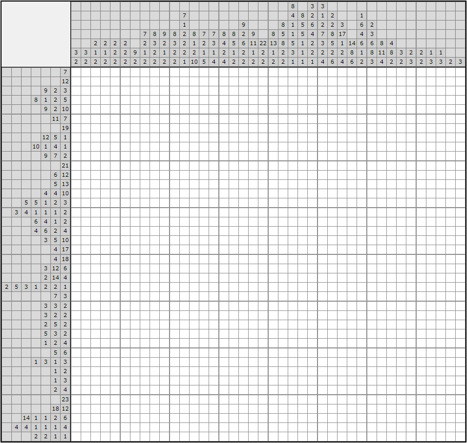

# nonogram-solver
This Python script will solve nonogram (picross) puzzles. It uses logical analysis of row/column data and is therefore somewhat faster than brute force. Other nonogram solvers use a more efficient approach.

# How it works
Puzzle data is formatted as follows:
```
puzzleData = {
  "horizontalClues": [[2], [1, 2], [8], [5], [3], [1]], 
  "verticalClues": [[1], [1, 2], [5], [5], [3], [2], [1], [1], [1]]
  }
```
It is then sent to the `solvePuzzle()` function.

# Options
Set `showWork` to `True` to display each step in the console.
Set `exportGif` to `True` to save an animated gif of the puzzle being solved in the current directory.

# Sample output
Here is a sample puzzle ([source](https://www.nonograms.org/nonograms/i/47433)):



And here is the output gif generated by the script:


